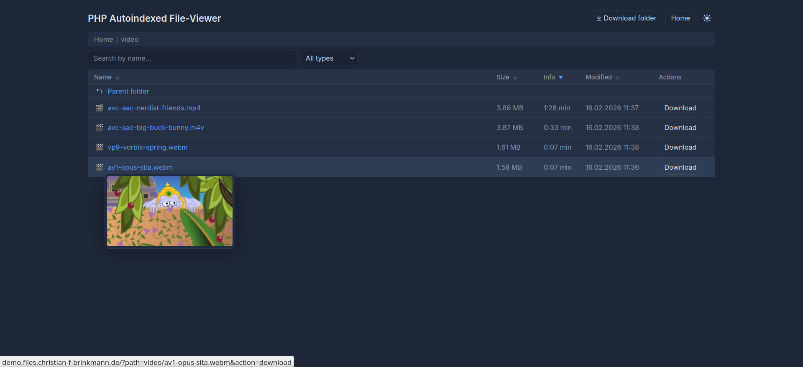
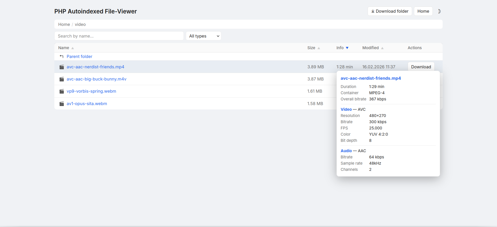

# PHP Autoindexed File-Viewer

A single-file, self-hosted file viewer written in PHP. Serves a directory listing with media analysis, thumbnail previews, and a dark/light theme — no frameworks, no build step.

<div style="display: flex; gap: 2%; justify-content: center;">
  <a href="screenshots/darkmode.png" target="_blank">
    
  </a>
  <a href="screenshots/lightmode.png" target="_blank">
    
  </a>
</div>

## Demo

A live demo of the application is available at [https://demo.files.christian-f-brinkmann.de/](https://demo.files.christian-f-brinkmann.de/). This instance is running the latest version of the code and contains a couple of sample files to demonstrate the features. Feel free to explore the interface and test out the functionality.


## Features

- **Single file** — everything lives in `index.php`.
- **Dark / light theme** toggle, persisted via cookie.
- **Breadcrumb navigation** with clickable path segments.
- **Column sorting** (name, size, date, type, media info) — remembered per folder.
- **Search / filter bar** for quick filtering of the current listing.
- **Media information** via `mediainfo` (resolution, codec, bitrate, duration, etc.).
- **Thumbnail hover previews** for images, videos, and PDFs.
- **Streaming ZIP downloads** of folders (Zip64-capable, no temp files).
- **Async task queue** — heavy jobs (thumbnails, media scans) run in background workers with concurrency limits and deduplication.
- **Live directory watching** — the page polls for changes and updates the listing in-place without a full reload.
- **Symlink support** — symbolic links are followed safely.
- **Cookie consent banner** with opt-in for preference cookies.
- **Broad format support:**
  Images (JPEG, PNG, GIF, BMP, SVG, WebP, ICO, TIFF, AVIF, HEIC, PSD, RAW/CR2/NEF/ARW/DNG),
  Audio (MP3, FLAC, WAV, AAC, OGG, WMA, M4A, OPUS, AIFF, APE, ALAC, MID),
  Video (MP4, MKV, AVI, MOV, WMV, FLV, WebM, M4V, TS, MPG, 3GP, OGV, and more),
  Documents (PDF, DOCX, ODT, PPTX, XLSX, EPUB, RTF, …),
  Archives (ZIP, TAR, GZ, BZ2, XZ, 7Z, RAR, ZST, …).

---

## Requirements

| Component | Purpose |
|---|---|
| **PHP 8.2+** with `php-fpm` | Runtime |
| `php-gd` | Image thumbnails (native formats) |
| `php-mbstring` | String handling |
| `php-zip` | ZIP downloads |
| `php-sqlite3` | Cache & task queue |
| `php-xml` | SVG metadata parsing |
| `mediainfo` | Audio / video / image metadata |
| `ffmpeg` | Video thumbnail extraction |
| `poppler-utils` | PDF thumbnails & info (`pdftoppm`, `pdfinfo`) |
| `imagemagick` | Fallback thumbnails for SVG, ICO, TIFF, HEIC, PSD, etc. |

A web server (nginx or Apache) configured to pass `.php` files to PHP-FPM. Personally, I recommend nginx, but in theory it should work with any setup that can execute PHP scripts.

---

## Installation

### Simple

You can simply download `index.php` and place it in the directory you want to serve. The script will create the `.cache_fb/` directory for thumbnails and metadata. However, you will need to manually ensure all dependencies are installed and configured correctly. Thus, this method is only recommended if you are comfortable setting up the required environment on your own. A complementary `install.sh` script is provided to automate the installation of dependencies on Debian/Ubuntu systems.

### via Git

```bash
# Clone the repository
git clone https://github.com/chrisb09/php-autoindexed-file-viewer.git /var/www/files
cd /var/www/files

# Install dependencies (Debian / Ubuntu)
sudo bash install.sh
```

The script installs all required PHP extensions and system packages, creates the `.cache_fb/` and `files/` directories with correct ownership, and restarts PHP-FPM.

#### nginx example

```nginx
server {
    listen 80;
    server_name files.example.com;
    root /var/www/files;
    index index.php;

    location / {
        try_files $uri $uri/ =404;
    }

    location ~ \.php$ {
        include fastcgi_params;
        fastcgi_pass unix:/var/run/php/php8.2-fpm.sock;
        fastcgi_param SCRIPT_FILENAME $document_root$fastcgi_script_name;
    }
}
```

Place the files you want to serve in the `files/` directory (or adjust `$BASE_DIR` at the top of `index.php`).

---

### Docker Deployment

You can also run the application in a Docker container. See [DOCKER.md](docker/DOCKER.md) for detailed instructions.

## Configuration

All configuration happens at the top of `index.php`:

| Variable | Default | Description |
|---|---|---|
| `$BASE_DIR` | `__DIR__ . '/files'` | Root directory to browse |
| `$CACHE_DIR` | `__DIR__ . '/.cache_fb'` | SQLite databases & thumbnails |
| `$MAX_WORKERS` | `3` | Max concurrent background task workers |

---

## Troubleshooting

The most common issues are:
- **Incorrectly setup web server**: Ensure your web server is configured to serve the directory and execute PHP scripts. Check error logs for clues.
- **Missing dependencies**: Ensure all required PHP extensions and system packages are installed. Check the output of `php -m` and `which mediainfo ffmpeg pdftoppm convert`.
- **Missing .cache_fb directory**: The script needs write access to create the cache directory. Ensure it exists and is writable by the web server user. Often, it is necessary to create the directory manually and set permissions:
  ```bash
  mkdir /var/www/files/.cache_fb
  chown www-data:www-data /var/www/files/.cache_fb
  ```
- **Permission issues**: Ensure the web server user has read access to the files being served and write access to the cache directory.
- **Visibility of symbolic links**: If you are using symbolic links, ensure that the web server user has permission to follow them and access the target files. Especially if you use docker, do not forget to mount the target directories into the container and ensure the www-data user has read access to them.

## Disclaimer: Use of generative AI

This project heavily involved the use of generative AI, specifically Anthropic's Claude Opus 4.6. In a way, this project is just a toy to see how far these models have come. The output is far from perfect and required many iterations as well as human suggestions and oversight, including small corrections, but generating a project of this size in less than a day is still interesting. The code is not always the most efficient or clean, but it mostly works, and that is good enough for now.

## License

MIT
